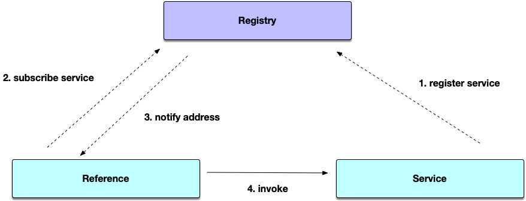

# SOFARPC

[English](#english) | [中文](#中文)

---

## English


[](https://codecov.io/gh/sofastack/sofa-rpc)

[](https://github.com/sofastack/sofa-rpc/releases)
[](https://isitmaintained.com/project/sofastack/sofa-rpc)
[](https://codeblitz.cloud.alipay.com/github/sofastack/sofa-rpc)

### Overview

SOFARPC is a high-performance, high-extensibility, production-ready Java RPC framework. Developed and refined over more than a decade at Ant Group across five generations, SOFARPC simplifies remote procedure calls between applications — providing transparent, stable, and efficient point-to-point service invocation without code intrusion.

The framework offers rich model abstractions and extensible interfaces (filter, routing, load balancing, etc.), making it easy to extend and adapt to varying business needs. It also provides a comprehensive MicroService governance solution built around SOFARPC and its ecosystem components.



### Features

| Category | Description |
|----------|-------------|
| **Transparent Invocation** | High-performance remote service calls with zero code changes required |
| **Flexible Routing** | Multiple service routing and load balancing strategies (random, round-robin, weighted, etc.) |
| **Multi-Registry Support** | Seamless integration with ZooKeeper, Nacos, Apollo, and more |
| **Multi-Protocol Support** | Bolt, Rest, Dubbo, H2, HTTP/2 (gRPC), and custom protocols |
| **Rich Invocation Modes** | Synchronous, one-way, callback, generalized (泛化调用), and mobile-specific invocations |
| **Fault Tolerance** | Cluster failover, service warm-up, automatic fault isolation, and retry strategies |
| **High Extensibility** | Easily extend filters, routers, load balancers, and registry components |
| **Observability** | Built-in tracing, metrics, and logging integration for operational visibility |

### Quick Start

```bash
# Clone the repository
git clone https://github.com/sofastack/sofa-rpc.git
cd sofa-rpc

# Build with Maven
mvn clean install -DskipTests

# Run examples
cd example && mvn clean install
```

For a detailed getting-started guide, see [Getting Started with SOFA-Boot](https://www.sofastack.tech/sofa-rpc/docs/Getting-Started-With-SOFA-Boot?lang=en).

### Documentation

| Document | Description |
|----------|-------------|
| [Getting Started](https://www.sofastack.tech/sofa-rpc/docs/Getting-Started-With-SOFA-Boot?lang=en) | Beginner's guide to SOFARPC |
| [User Guide](https://www.sofastack.tech/sofa-rpc/docs/Programming?lang=en) | Complete feature reference |
| [Developer Guide](https://www.sofastack.tech/sofa-rpc/docs/How-To-Build?lang=en) | Build and development instructions |
| [Release Notes](https://www.sofastack.tech/sofa-rpc/docs/ReleaseNotes?lang=en) | Version history and changelog |
| [Road Map](https://www.sofastack.tech/sofa-rpc/docs/RoadMap?lang=en) | Future plans and milestones |

### Related Projects

- [sofa-rpc-boot-projects](https://github.com/sofastack/sofa-rpc-boot-projects) — SOFABoot starters and samples for SOFARPC

### Requirements

| Requirement | Version |
|-------------|---------|
| JDK | 8 or above |
| Maven | 3.2.5 or above |

### Contributing

We welcome contributions! Please see our [Contributing Guide](https://www.sofastack.tech/sofa-rpc/docs/Contributing?lang=en) for details. Before submitting a non-trivial pull request, please sign the [Contributor License Agreement (CLA)](https://www.sofastack.tech/sofa-rpc/docs/Contributing?lang=en).

### Contact & Support

- **DingTalk Group** (Scan the QR code below)

  

### License

SOFARPC is licensed under the [Apache License 2.0](https://github.com/sofastack/sofa-rpc/blob/master/LICENSE). Third-party dependencies and their respective licenses are documented in [NOTICE](https://www.sofastack.tech/sofa-rpc/docs/NOTICE?lang=en).

---

## 中文


[](https://codecov.io/gh/sofastack/sofa-rpc)

[](https://github.com/sofastack/sofa-rpc/releases)
[](https://codeblitz.cloud.alipay.com/github/sofastack/sofa-rpc)

### 简介

SOFARPC 是蚂蚁集团开源的高可扩展性、高性能、生产级 Java RPC 框架。历经十多年、五代版本的技术沉淀，SOFARPC 致力于简化应用间的 RPC 调用，为应用提供透明、稳定、高效的点对点远程服务调用方案，同时保持对业务代码的零侵入。

框架提供丰富的模型抽象和可扩展接口（过滤器、路由、负载均衡等），支持按需扩展各个功能组件。围绕 SOFARPC 核心及周边组件，提供完整的微服务治理方案。


### 功能特性

| 类别 | 说明 |
|------|------|
| **透明化调用** | 高性能远程服务调用，对业务代码零侵入 |
| **灵活路由** | 支持随机、轮询、加权等多种服务路由与负载均衡策略 |
| **多注册中心** | 支持 ZooKeeper、Nacos、Apollo 等主流注册中心 |
| **多协议支持** | 支持 Bolt、Rest、Dubbo、H2、HTTP/2（gRPC）及自定义协议 |
| **丰富调用方式** | 支持同步、单向、回调、泛化调用、移动端调用等 |
| **容错容灾** | 支持集群容错、服务预热、自动故障隔离和重试策略 |
| **高扩展性** | 过滤器、路由、负载均衡、注册中心等组件均支持按需扩展 |
| **可观测性** | 内置链路追踪、性能指标和日志集成，开箱即用 |

### 快速开始

```bash
# 克隆代码
git clone https://github.com/sofastack/sofa-rpc.git
cd sofa-rpc

# 使用 Maven 构建
mvn clean install -DskipTests

# 运行示例
cd example && mvn clean install
```

详细入门指南请参考 [SOFAStack 官方文档 - SOFA-Boot 快速开始](http://www.sofastack.tech/sofa-rpc/docs/Getting-Started-With-SOFA-Boot)。

### 文档

| 文档 | 说明 |
|------|------|
| [快速开始](http://www.sofastack.tech/sofa-rpc/docs/Getting-Started-With-SOFA-Boot) | 新手入门指南 |
| [用户手册](http://www.sofastack.tech/sofa-rpc/docs/Programming) | 完整功能参考 |
| [开发者指南](http://www.sofastack.tech/sofa-rpc/docs/How-To-Build) | 构建与开发说明 |
| [发布历史](http://www.sofastack.tech/sofa-rpc/docs/ReleaseNotes) | 版本更新日志 |
| [发展路线](http://www.sofastack.tech/sofa-rpc/docs/RoadMap) | 未来规划与里程碑 |

### 关联项目

- [sofa-rpc-boot-projects](https://github.com/sofastack/sofa-rpc-boot-projects) — SOFABoot 扩展项目，包含 Starter 及完整使用示例。

### 环境要求

| 需求 | 版本 |
|------|------|
| JDK | 8 及以上 |
| Maven | 3.2.5 及以上 |

### 参与贡献

欢迎提交 Pull Request！详情请参阅 [贡献指南](http://www.sofastack.tech/sofa-rpc/docs/Contributing)。提交重大修改前，请先签署 [贡献者许可协议（CLA）](http://www.sofastack.tech/sofa-rpc/docs/Contributing)。

### 联系我们

- **钉钉群**（扫码加入）

  

### 致谢

SOFARPC 最早源于阿里内部的 HSF，非常感谢毕玄创造了 HSF，为 SOFARPC 的发展奠定了良好基础，也非常感谢寒泉子、独明、世范在 SOFARPC 发展过程中作出的贡献。

### 开源许可

SOFARPC 基于 [Apache License 2.0](https://github.com/sofastack/sofa-rpc/blob/master/LICENSE) 协议开源。第三方依赖及各自协议详见[依赖组件版权说明](http://www.sofastack.tech/sofa-rpc/docs/NOTICE)。
