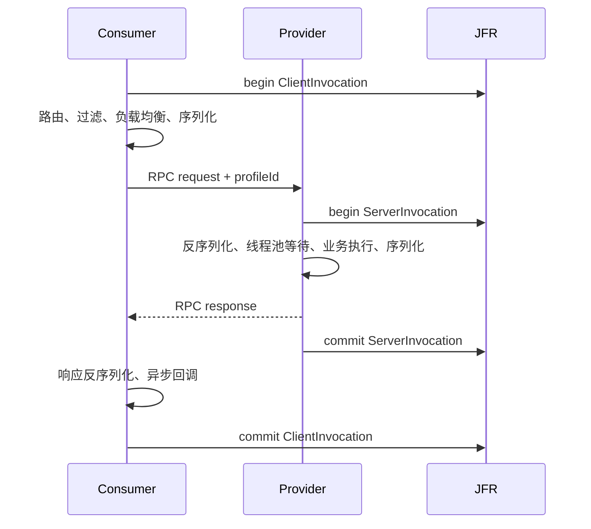

# SOFA RPC JFR Profile

`sofa-rpc-profile-jfr` 基于 Java Flight Recorder（JFR）记录一次 RPC 调用在客户端和服务端各阶段的耗时，
主要用于排查“整体调用超时，但不知道时间消耗在哪里”的线上问题。

## 工作原理



客户端在调用开始时生成 `profileId`，并通过请求属性传递到服务端。报告工具使用该标识关联不同进程、
不同 JFR 文件中的客户端和服务端事件。只在一端启用采集也可以使用，报告会将另一端标记为
`not recorded`。

客户端、服务端的采集生命周期通过 SOFA RPC 内部 EventBus 驱动。为了跨进程关联两端事件，客户端生成的
`profileId` 会通过 Bolt 请求属性或 Triple metadata 传递到服务端。未配置 `default.profile` 时模块不会加载，
也不会注册事件订阅者或生成关联标识。

客户端采集使用协议共享的调用事件；服务端当前完成 Bolt 和 Triple 的关联实现与端到端验证。
其他发布标准 `ServerReceiveEvent` / `ServerSendEvent` 的协议可以记录单端事件，但在补充 `profileId` 传播测试前
不承诺客户端、服务端一定能够关联。RESTEasy 服务端使用独立事件类型，不在本模块首版覆盖范围内。

模块使用两个职责不同的 SOFA RPC SPI：

- `Module` SPI负责按 `default.profile=jfr` 自动安装Profile并注册EventBus订阅者；
- `Profile` SPI负责将扩展名 `jfr` 动态映射到JFR采集实现。

这种装配方式与现有Tracer模块一致，既保留Profile实现的可替换性，也避免核心模块直接依赖JFR。

## 接入

Consumer 和 Provider 都增加依赖：

```xml
<dependency>
    <groupId>com.alipay.sofa</groupId>
    <artifactId>sofa-rpc-profile-jfr</artifactId>
    <version>${sofa.rpc.version}</version>
</dependency>
```

在 SOFA RPC 初始化前启用 JFR Profile SPI：

```text
-Ddefault.profile=jfr
```

推荐使用 JDK 11 或更高版本，并在启动 JVM 时开始录制：

```bash
java -Ddefault.profile=jfr \
  -XX:StartFlightRecording=name=sofa-rpc,settings=profile,filename=sofa-rpc.jfr,dumponexit=true \
  -jar application.jar
```

也可以对运行中的进程临时采集：

```bash
jcmd <pid> JFR.start name=sofa-rpc settings=profile
jcmd <pid> JFR.dump name=sofa-rpc filename=sofa-rpc.jfr
jcmd <pid> JFR.stop name=sofa-rpc
```

JFR 自定义事件默认启用。`settings=profile` 同时开启更详细的 JVM 采样，适合短时间问题诊断；
长期连续采集应根据实际开销调整 JFR 配置。

## 生成调用阶段报告

单进程文件：

```bash
java -jar sofa-rpc-profile-jfr-VERSION.jar --top 20 sofa-rpc.jfr
```

Consumer 和 Provider 分别录制时，可以一次传入多个文件：

```bash
java -jar sofa-rpc-profile-jfr-VERSION.jar \
  --top 20 consumer.jfr provider.jfr
```

报告示例：

```text
SOFA RPC JFR Profile Report
JFR files: 2, RPC events scanned: 2, invocation groups: 1 selected, correlated client/server: 1

#1 profileId=8de6c76d-...
  service=com.example.GreetingService:1.0#hello
  client: 18.420 ms SUCCESS  consumer -> provider  [bolt/sync]
    router                        [##----------] 2.100 ms ( 11.4%)
    client filters                [#-----------] 1.200 ms (  6.5%)
    request serialization         [#-----------] 0.900 ms (  4.9%)
  server: 12.310 ms SUCCESS  consumer -> provider  [bolt/sync]
    business thread-pool wait     [####--------] 4.200 ms ( 34.1%)
    business invocation           [######------] 6.400 ms ( 52.0%)
  largest recorded phase: server.business invocation = 6.400 ms
```

报告按客户端或服务端的最大总耗时降序排列。工具先扫描所有文件并仅保留耗时最大的 `--top` 个
`profileId`，再进行第二遍读取并加载这些调用的详细字段，因此内存不会随录制时间和总调用数无限增长。
`invocation groups` 和 `correlated client/server` 均表示最终选中并展示的分组数量。一个 `profileId` 对应一个
调用分组；缺失阶段不会展示，阶段值来自 SOFA RPC 在实际执行位置记录的纳秒级耗时数据：

| 标记 | 阶段 |
| --- | --- |
| R0 | 流式调用首个响应 |
| R1 | 客户端路由 |
| R2 | 连接创建 |
| R3 | 客户端过滤器 |
| R4 | 负载均衡 |
| R5-1 / R5-2 | 请求序列化 / 反序列化 |
| R6-1 / R6-2 | 响应序列化 / 反序列化 |
| R7 | 服务端业务线程池等待 |
| R8 | 业务方法执行 |
| R10 | 服务端过滤器 |
| R11 | 服务端网络等待 |

模块用一个客户端持续时间事件表示整次Consumer调用，用一个服务端持续时间事件表示整次Provider处理。
EventBus在调用开始时创建并开始事件，在调用过程中补充地址、数据量和结果等元数据，在调用结束时填入上述
阶段耗时并提交事件。这样可以使用现有的真实阶段计时，而不会在调用结束后伪造阶段开始时间。

## 端到端验证

仓库中的 `JfrProfileIntegrationTest` 会启动真实的 Bolt 和 Triple Provider/Consumer，执行RPC调用，生成JFR文件，
再使用报告工具断言客户端、服务端事件能够按 `profileId` 关联。`JfrProfileModuleTest` 还会启动独立JVM，使用
`-Ddefault.profile=jfr` 验证Module SPI自动发现和安装路径：

```bash
./mvnw -pl test/test-integration -am \
  -Dtest=JfrProfileIntegrationTest -DfailIfNoTests=false test
```

这些测试使用程序化 `Recording`，不依赖本机提前启动JMC或手工执行 `jcmd`。阶段耗时保存在每次RPC独立的
`RpcInternalContext` 中，同一线程连续发起多个异步调用时不会共享阶段状态。

## JFR 数据和火焰图

该模块定义两个持续时间事件：

- `com.alipay.sofa.rpc.ClientInvocation`
- `com.alipay.sofa.rpc.ServerInvocation`

事件还包含服务、方法、应用、协议、调用类型、地址、结果、错误类型、SOFA RPC 错误码、请求/响应大小
和重试次数。出于安全考虑，不记录方法参数、响应内容和异常消息。

这两个自定义事件用于汇总 RPC 调用时间和阶段耗时，本身关闭了调用栈采集，因此报告工具不会根据它们生成
CPU火焰图。CPU火焰图需要同一份JFR中的 `jdk.ExecutionSample` 等JVM采样事件，可以使用JDK Mission Control
或其他支持JFR采样事件的工具查看。火焰图回答“CPU在执行什么代码”，阶段报告回答“一次RPC的时间消耗在哪个
阶段”，两者用途不同且可以结合分析。

## JDK 8 说明

模块可以在包含 `jdk.jfr` API 的新版 OpenJDK 8 发行版上编译和运行，但生产环境推荐 JDK 11+。
较早的 Oracle JDK 8 还可能要求 JVM 参数 `-XX:+UnlockCommercialFeatures -XX:+FlightRecorder`；具体以所用
JDK 发行版为准。
部分 JDK 8 实现存在连续停止、重新启动 Recording 后字符串常量池缺失的已知问题
[`JDK-8257621`](https://bugs.openjdk.org/browse/JDK-8257621)，可能使后一次录制中的部分字符串显示为空。
如果必须使用 JDK 8，建议一次启动持续录制，并先验证所用 JDK 发行版的 JFR 行为。
